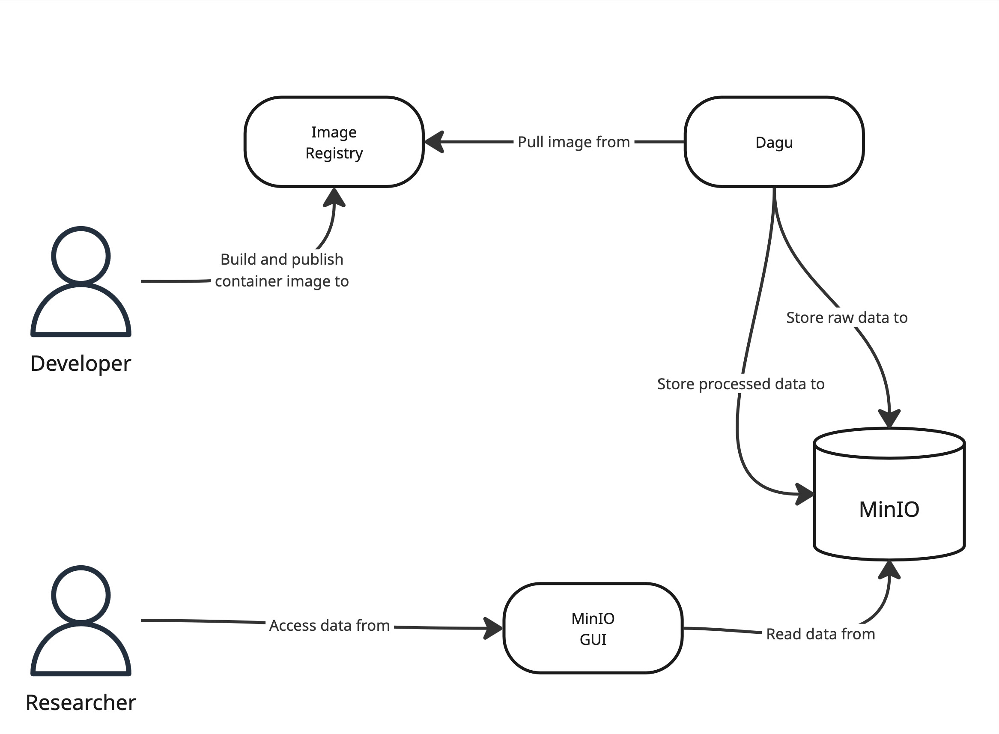

# Power Outage Data Scraping

## Overview

This repo contains the workflow for scraping data from power providers in different countries using Docker, DAGU, and minio.
- scapers: written in Python using libraries like scrapy.
- Docker: containerizes the scraping, post-processing, and upload scripts.
- DAGU: orchestrates each of the scrapers, running them periodically and managing the various logs and re-tries.
- minio: block storage for the scraped data.

## Architecture



<!-- ## Example

Refer to the `src/scrapers/brazil/aneel` scraper. -->

## Requirements

<!-- Working `scraper.py` and `post_process.py` files for each country and power provider. -->
TBD. 

## Getting Started
### Running a single scraper
TBD.

TODO: prolly specify an easier workflow for local testing, and then something else for DAGU-docker-minio integration.

### Adding a scraper to DAGU
<!-- 1. Specify a YAML inside of /dagu_config/dags
2.  -->
- Create a DAGU configuration file in `dagu_config/dags` to define the DAG (workflow) for the scraper.
- The DAG should include the tasks for scraping and post-processing.
- The name should be `{country}_{company}.yaml` Here's an example configuration and reference to the YAML Specification can be found in [here](https://docs.dagu.cloud/reference/yaml).

```yaml
# https://docs.dagu.cloud/features/scheduling
# schedule: "0 2 * * *" # Daily at 2 AM
steps:
  - name: scrape
    executor:
      type: docker
      config:
        image: localhost:5000/brazil-aneel-scraper:latest
        autoRemove: true
    command: python scrape.py


  - name: process
    executor:
      type: docker
      config:
        image: localhost:5000/brazil-aneel-scraper:latest
        autoRemove: true
    command: python post_process.py
```


### Running the entire set of scrapers 
**NOTE**: the commands on this readme assumes a UNIX working environment.

Starting the containers. Check docker-compose.yml for the services that will be started.

```
make run
```

Publish the image by running the command below. It will auto detect the scrapers in the `src/scrapers` and create a Dockerfile.

```shell
make publish
```

The published image can be verified in the registry by running the following commands:

```
curl http://localhost:5000/v2/_catalog
curl http://localhost:5000/v2/myapp/tags/list
```

Navigate to DAGU to run dags in `localhost:8080`
and the block storage interface can be accessed in `localhost:9090` with the default name/password: `minioadmin`

### Testing DAGU
- print statements will not print until the particular step is finished
  - e.g.: if you have a long scrape step, nothing prints until scrape finishes. using print() with flush=True doesn't seem to fix this.
- make a change in python → rebuild the docker container
  - `./publish-single.sh ./src/scrapers/your_scraper_here`
- rerun specific portions of DAGU
  - e.g.: to rerun the proces part but not the scrape part
  - click on DAG you want to edit
  - right click → set status to success
  - click on "retry DAG execution" (the whirly symbol -- NOT the arrow to "start execution")


## Resources

<https://github.com/dagu-org/dagu>

<https://github.com/minio/minio>

## Last Updated
10/6/25