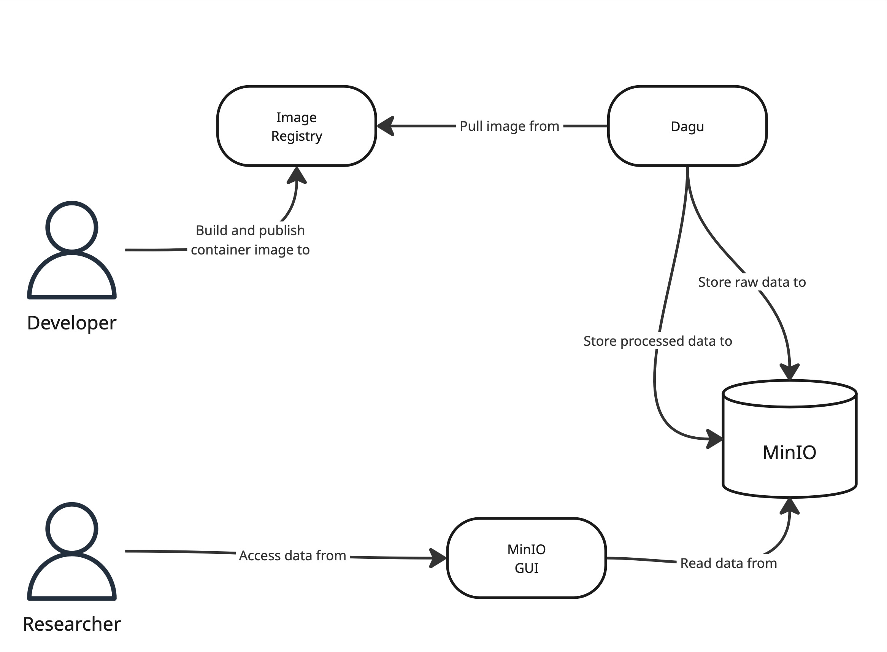
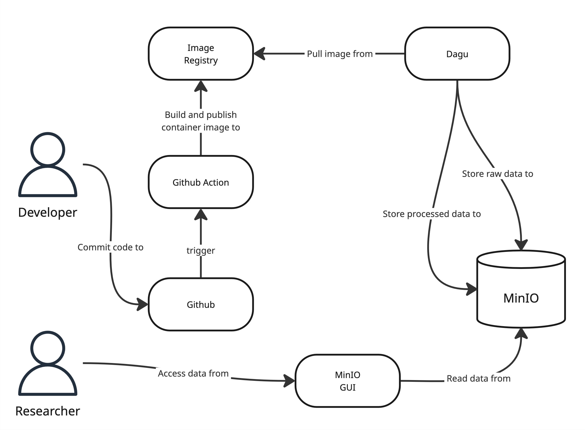

# Workflow

This explains the workflow for scraping data from power providers in different countries using DAGU, minio, and Docker.

DAGU is the platform used to orchestrate the scraping tasks, while minio serves as the block storage for storing the scraped data. Docker is used to containerize the scraping and post-processing scripts.

**NOTE**: the commands on this readme assumes a unix working environment.

## Architecture



## Example

Refer to the `src/scrapers/brazil/aneel` scraper.

## Requirements

Working `scraper.py` and `post_process.py` files for each country and power provider.

## Getting Started

Starting the containers. Check docker-compose.yml for the services that will be started.

```
make run
```

Publish the image by running the command below. It will auto detect the scrapers in the `src/scrapers` and create a Dockerfile.

```shell
make publish
```

The published image can be verified in the registry by running the following commands:

```
curl http://localhost:5000/v2/_catalog
curl http://localhost:5000/v2/myapp/tags/list
```

Create a DAGU configuration file in `dagu_config/dags` to define the DAG for the scraper.
The DAG should include the tasks for scraping and post-processing.
The name should be `{country}_{company}.yaml` Here's an example configuration and reference to the YAML Specification can be found in [here](https://docs.dagu.cloud/reference/yaml).

```yaml
# https://docs.dagu.cloud/features/scheduling
# schedule: "0 2 * * *" # Daily at 2 AM
steps:
  - name: scrape
    executor:
      type: docker
      config:
        image: localhost:5000/brazil-aneel-scraper:latest
        autoRemove: true
    command: python scrape.py


  - name: process
    executor:
      type: docker
      config:
        image: localhost:5000/brazil-aneel-scraper:latest
        autoRemove: true
    command: python post_process.py
```

Navigate to DAGU to run dags in `localhost:8080`
and the block storage interface can be accessed in `localhost:9090` with the default name/password: `minioadmin`

## Architecture TBD



## Resources

<https://github.com/dagu-org/dagu>

<https://github.com/minio/minio>
